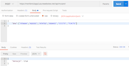
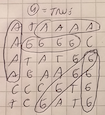
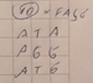
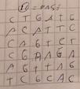
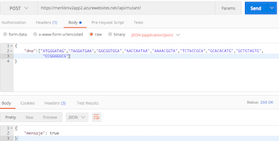
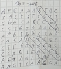

# Ejercicio Mer. Lib. Nivel 2 (Agosto 2019)
###### Autor: [Manuel Moya - mmoyam@gmail.com]
El objetivo de este documento es detallar la resolución del caso Mer. Lib. Nivel 2, donde se debe crear una api y desplegarlo en un servicio Cloud. Esto basado en el algortimo que detecta mutantes basados su secuencia de ADN del ejercicio anterior [(Nivel 1)](https://github.com/manumoya/MerLibNiv1/).

### Enunciado

* Crear una API REST, hostear esa API en un cloud computing libre (Google App Engine, Amazon AWS, etc), crear el servicio “/mutant/” en donde se pueda detectar si un humano esmutante enviando la secuencia de ADN mediante un HTTP POST con un Json el cual tenga el siguiente formato:

		POST /mutant/
		
		{
		“dna”:["ATGCGA","CAGTGC","TTATGT","AGAAGG","CCCCTA","TCACTG"]
		}

* En caso de verificar un mutante, debería devolver un HTTP 200-OK, en caso contrario un 403-Forbidden

### Entregables

* Código Fuente en repositorio github.
* Instrucciones de cómo ejecutar el programa o la API. 
* URL de la API.

### Idea principal

* Crear api con java Jersey 2.0.
* Utilizar servidor linux con Apache Web Server.
* Utilizar servicios Azure (cuenta estudiante).

### Supuestos
* No hay supuestos adicionales

### Descripción del programa

El programa considera los siguientes Packages

* **com.merlib.models**: Contiene los java beans utilizados.
* **com.merlib.process**: Contiene los programas que tienen algun proceso de negocio.
* **com.merlib.services**: Contiene los programas que habilitan la api /mutant/.

Los programas son los siguientes:

* **com.merlib.models**: 
	* Respuesta.java
* **com.merlib.process**: 
	* Mutant.java
* **com.merlib.services**: 
	* Mutante.java

Las pruebas unitarias se encuentran en el archivo [MutantTest.java](https://github.com/manumoya/MerLibNiv2/tree/master/src/test/java/com/merlib/process/MutantTest.java).

### Tecnología utilizada
* java 7.*
* Jersey 2.* (api framework)
* Junit 4.*
* Azure Cloud
* Linux Server
* Apache Tomacat 8.*
* Deploy basado en GitHub
* Postman (request client)
* Apache Jmeter 3.* (Performance tool)
* MAC OS X 	

### Traza
Los casos probados fueron los mismos casos de Nivel 1. Algunas de las trazas:

|Caso 1 = true | Caso 4 = true |
|---|---|
|  |  | 
| Caso 10 = false | Caso 11 = false |  
| |  |
|Caso 13 = true | Caso 16 = true | 
| |  | 
 

### ¿Se puede mejorar?

Se puede mejorar, por ejemplo agregando Swagger para la documentación e la API

### Ejecución del programa

* La url de la API es: [merlibniv2app2.azurewebsites.net](https://merlibniv2app2.azurewebsites.net/)
* API Método: 
		
		POST
		
* API Path:
 
		/api/mutant/

* API json request:

		{
			“dna”:["ATGCGA","CAGTGC","TTATGT","AGAAGG","CCCCTA","TCACTG"]
		}
		
* Response Status:

		200 ok o no403 Forbiden
		
* Response Body:

		{"mensaje": true} o {"mensaje": false}		
	
* Consideraciones de llamado:
	* En el header debe ser configurado con Content-Type = application/json