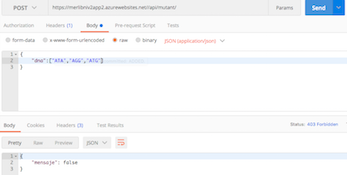

# Ejercicio MeLi Nivel 2 (Agosto 2019)
###### Autor: [Manuel Moya - mmoyam@gmail.com]
El objetivo de este documento es detallar la resolución del caso MeLi Nivel 2, donde se debe crear una api y desplegarlo en un servicio Cloud. Esto basado en el algortimo que detecta mutantes basados su secuencia de ADN del ejercicio anterior [(Nivel 1](https://github.com/manumoya/MerLibNiv1/).

### Enunciado

* Crear una API REST, hostear esa API en un cloud computing libre (Google App Engine,Amazon AWS, etc), crear el servicio “/mutant/” en donde se pueda detectar si un humano esmutante enviando la secuencia de ADN mediante un HTTP POST con un Json el cual tenga el siguiente formato:

	**POST → /mutant/**
	
	**{
	“dna”:["ATGCGA","CAGTGC","TTATGT","AGAAGG","CCCCTA","TCACTG"]
	}**

* En caso de verificar un mutante, debería devolver un HTTP 200-OK, en caso contrario un 403-Forbidden

### Entregables

* Código Fuente en repositorio github.
* Instrucciones de cómo ejecutar el programa o la API. 
* URL de la API.

### Idea principal

* Crear api con java Jersey 2.0.
* Utilizar servidor linux con Apache web server.
* Utilizar servicios azure (cuenta estudiante).

### Supuestos
* bla bla

### Descripción del programa

El programa considera los siguientes Packages

* **com.merlib.models**: Contiene los java beans utilizados.
* **com.merlib.process**: Contiene los programas que tienen algun proceso de negocio.
* **com.merlib.services**: Contiene los programas que habilitan las api /mutant/.

Los programas son los siguientes:

* **com.merlib.models**: 
	* Respuesta.java
* **com.merlib.process**: 
	* Mutant.java
* **com.merlib.services**: 
	* Mutante.java

Las pruebas unitarias se encuentran en el archivo [MutantTest.java](https://github.com/manumoya/MerLibNiv2/tree/master/src/test/java/com/merlib/process/MutantTest.java).

### Tecnología utilizada
* java 7.*
* Jersey 2.* (api framework)
* Junit 4.*
* Azure App Service
* Apache Tomacat 8.*
* Linux Server
* Deploy basado en GitHub

### Traza
Los probados fueron los mismos de Nivel 1:

|Caso 1 = true | Caso 2 = true | Caso 3 = true | Caso 4 = true | Caso 5 = true | Caso 6 = true |
|---|---|---|---|---|---|
|  |  |  |  |  |  |
| Caso 7 = true | Caso 8 = false | Caso 9 = false | Caso 10 = false | Caso 11 = false | Caso 12 = true 
|  |  |  |  |  |  |
| Caso 13 = true | Caso 14 = false | Caso 15 = false | Caso 16 = true | Caso 17 = X | Caso 18 = X 
|  |  |  |  |  |  |

Los cuales se reflejan en el siguiente código:

### ¿Se puede mejorar?

Se puede mejorar, entregando a cada análisis la cantidad de secuencia de ADN encontrada en el análisis anterior, de esta forma evita hacer procesamiento adicional. Es decir, si existe una secuencia horizontal, basta que encuentre una vertical (o diagonal) para que sea mutante.

### Ejecución del programa

* Ingresar a la carpeta donde esté el archivo [Mutant.class](https://github.com/manumoya/MerLibNiv1/blob/master/out/production/MerLibNiv1/Mutant.class)
* Ejecutar la siguiente línea de comando: **java Mutant**
* El adn debe ser ingresado en el siguiente formato: **ATAAA,AGGGG,ATGGG,AGGGG,CGCGG**
* Ejemplo:

	